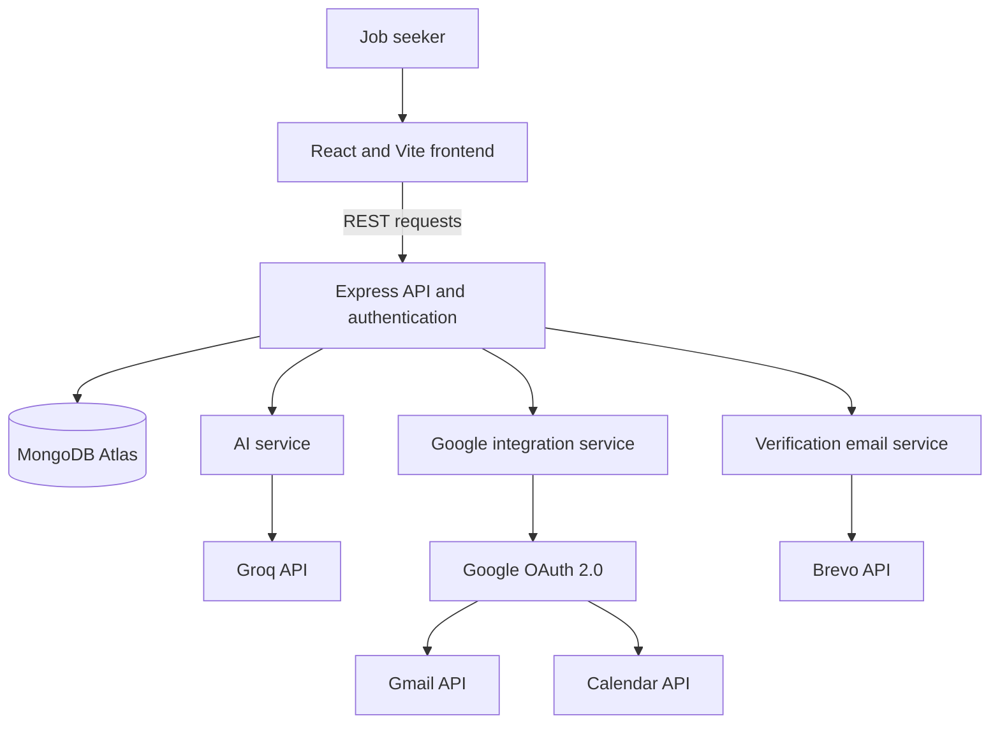
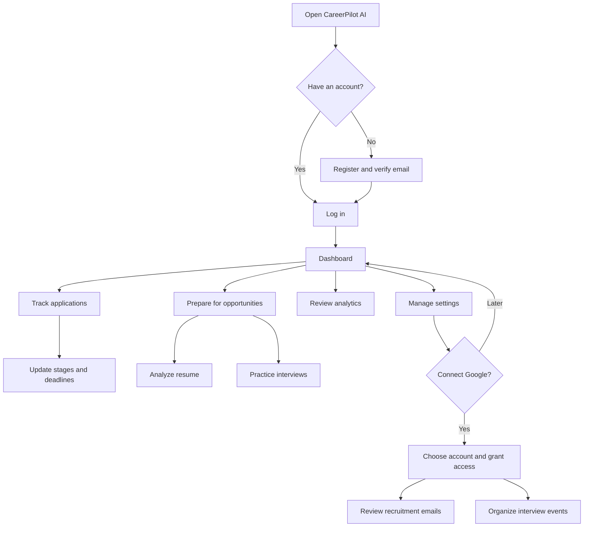
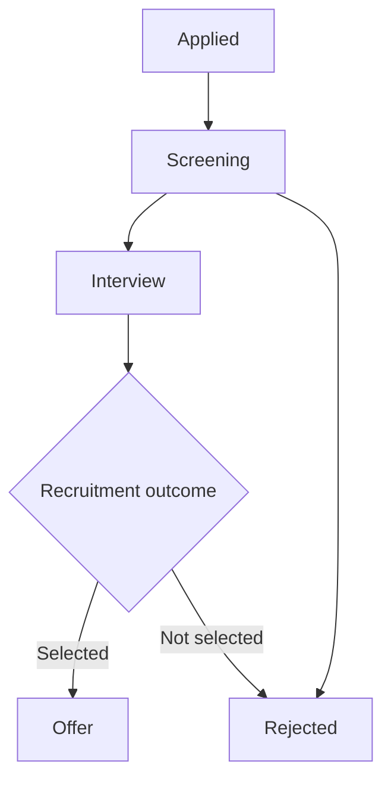
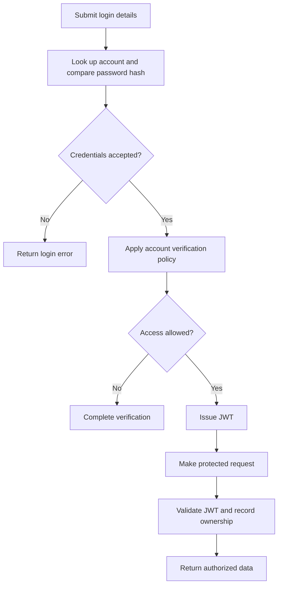
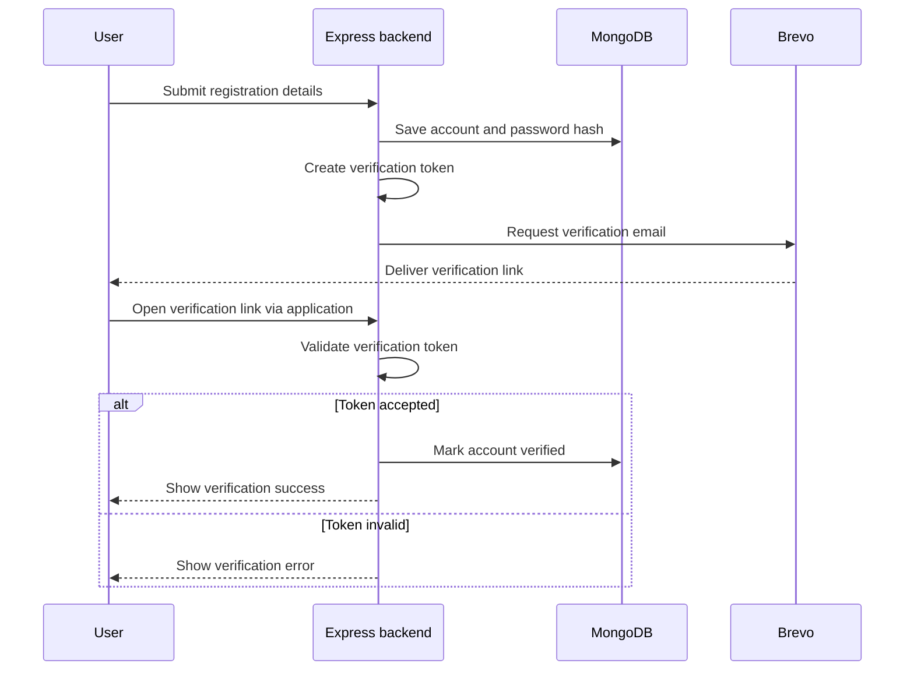
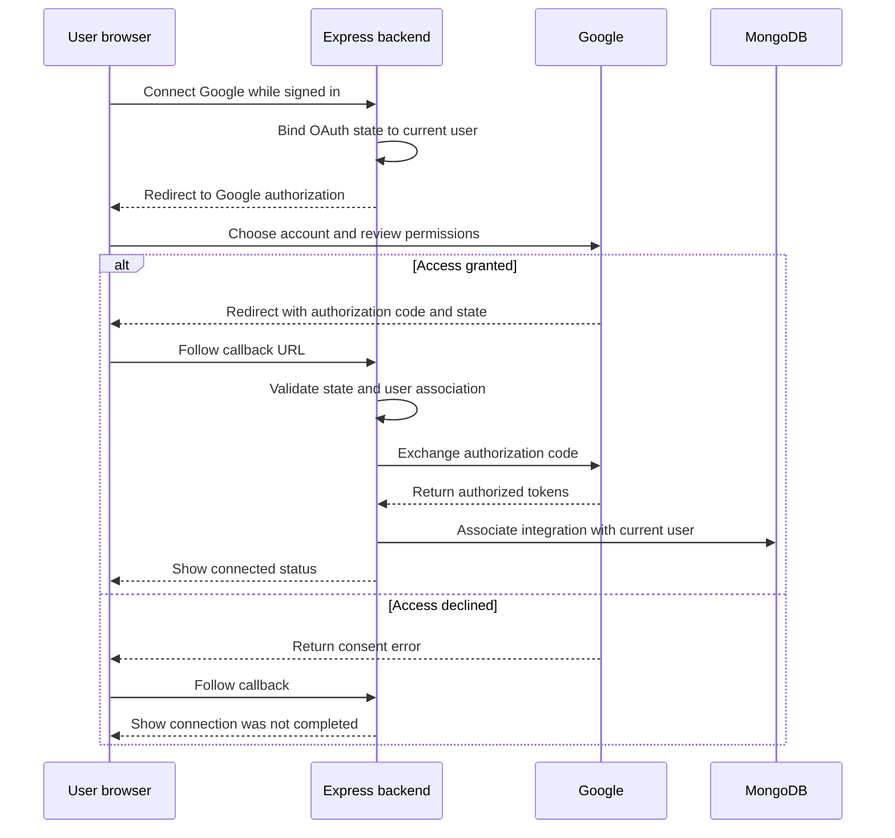
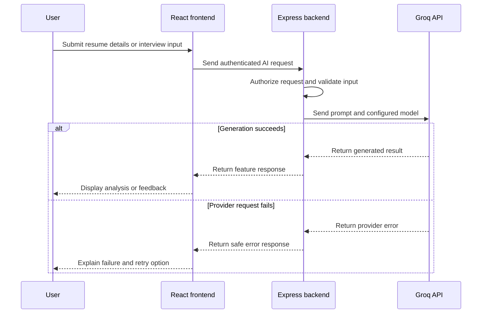

# CareerPilot AI

**Track applications. Improve your resume. Prepare for your next opportunity.**


CareerPilot AI is a full-stack career management platform that brings job application tracking, resume analysis, AI interview preparation, application analytics, and Google integrations into one workspace. Built for students, freshers, and job seekers, it helps users organize their job search and prepare more consistently for recruitment opportunities.

The application combines a React interface with an Express backend, MongoDB Atlas, and server-side AI requests through Groq. Gmail and Google Calendar integrations connect recruitment communications and scheduling with the rest of the job-search workflow.

[Open the application](https://career-pilot-ai-coral-omega.vercel.app) · [GitHub repository](https://github.com/HemanthReddy030/CareerPilot-AI) · [Local setup](#installation-and-local-development) · [User guide](#how-to-use-careerpilot-ai)

## Table of Contents

- [Overview](#overview)
- [Problem and Solution](#problem-and-solution)
- [Project Objectives](#project-objectives)
- [Features](#features)
- [Technology Stack](#technology-stack)
- [System Architecture](#system-architecture)
- [Application Workflows](#application-workflows)
- [Project Structure](#project-structure)
- [Prerequisites](#prerequisites)
- [Installation and Local Development](#installation-and-local-development)
- [Environment Configuration](#environment-configuration)
- [External Service Setup](#external-service-setup)
- [How to Use CareerPilot AI](#how-to-use-careerpilot-ai)
- [Deployment](#deployment)
- [Security and Privacy](#security-and-privacy)
- [Troubleshooting](#troubleshooting)
- [Engineering Challenges](#engineering-challenges)
- [Future Enhancements](#future-enhancements)
- [Screenshots](#screenshots)
- [Contributing](#contributing)
- [Developer](#developer)
- [License](#license)
- [Documentation and References](#documentation-and-references)

## Overview

| Area | Description |
| --- | --- |
| Project type | Full-stack web application with AI-assisted career tools |
| Intended users | Students, fresh graduates, and active job seekers |
| Main purpose | Organize applications, preparation, and recruitment activity in one place |
| Core stack | MongoDB, Express, React, and Node.js |
| AI provider | Groq API, accessed through the backend |
| Integrations | Google OAuth 2.0, Gmail API, Google Calendar API, and Brevo API |
| Hosting | Vercel for the frontend; Render for the backend; MongoDB Atlas for the database |

**Project links**

| Resource | Address |
| --- | --- |
| Frontend | [career-pilot-ai-coral-omega.vercel.app](https://career-pilot-ai-coral-omega.vercel.app) |
| Backend service | [careerpilot-ai-server-uz77.onrender.com](https://careerpilot-ai-server-uz77.onrender.com) |
| Source repository | [HemanthReddy030/CareerPilot-AI](https://github.com/HemanthReddy030/CareerPilot-AI) |
| Privacy policy | [Privacy Policy](https://career-pilot-ai-coral-omega.vercel.app/privacy-policy) |
| Terms | [Terms of Service](https://career-pilot-ai-coral-omega.vercel.app/terms) |

These addresses follow the project documentation. The backend link is a service base URL; its root path may not provide a public page.

## Problem and Solution

### The problem

Job seekers often manage applications across spreadsheets, job portals, email inboxes, calendars, documents, and personal notes. As the number of applications grows, it becomes harder to remember application stages, interview dates, deadlines, recruiter updates, and the resume used for each opportunity.

This fragmented process can cause missed follow-ups, duplicate records, overlooked interviews, and inconsistent preparation. Students and freshers also need practical support with resume improvement, skill development, and interview practice.

### The solution

CareerPilot AI provides a centralized workspace for the job-search journey. Users can organize application records, review their progress, work on resumes, and prepare for interviews. Optional Google connections bring email and calendar features into the same platform, while AI tools assist with preparation and written content.

The platform is designed to reduce administrative effort and help users make better use of their preparation time.

## Project Objectives

- Maintain organized, user-specific job application records.
- Make application progress, deadlines, and interview activity easier to follow.
- Support resume analysis and targeted career preparation.
- Provide AI-assisted interview questions and answer feedback.
- Bring recruitment email and calendar workflows into the application through user consent.
- Present job-search progress through dashboards and visual analytics.
- Protect account access with password hashing, JWT authentication, and email verification.
- Keep external service credentials and integration logic on the backend.

## Features

### Core modules

The following modules are described in the project documentation. Feature availability depends on the checked-out version and configured services.

| Module | Capabilities |
| --- | --- |
| Account and authentication | Registration, login, password hashing, JWT authentication, protected API routes, and email verification |
| Dashboard | Application statistics, recent applications, and access to key career tools |
| Application management | Maintain company and role information, application dates, recruitment stages, deadlines, and notes |
| Resume workspace | Upload resumes and access resume analysis and improvement workflows |
| AI interview preparation | Practice workflows for technical, coding, HR, and behavioral interviews |
| Company information | A company details and research area to support application and interview preparation |
| Analytics | Application totals, status distribution, progress, and interview-related activity visualized with Recharts |
| Gmail integration | Read-only access to help users review application confirmations, recruiter messages, invitations, and recruitment updates |
| Google Calendar integration | Work with interview and recruitment events through the connected Google account |
| Settings | Account preferences, integration configuration, and notification-related preferences |
| Public information | Home, Privacy Policy, and Terms of Service pages |

### Extended feature scope

The project brief describes the following tools as implemented **or intended**, without confirming each tool individually. This list preserves the complete feature scope; it is not a release checklist of verified implementations.

| Area | Feature scope |
| --- | --- |
| Resume intelligence | ATS-oriented resume score, resume analysis, keyword optimization, skill gap analysis, improvement suggestions, and resume management |
| Career assistance | AI cover letters, AI-assisted company research, and learning resource recommendations |
| Interview preparation | Interview checklists; coding, technical, HR, and behavioral questions; AI answer evaluation |
| Application organization | Deadline tracking, application timelines, document management, and duplicate application detection |

An AI-generated ATS-oriented score is advisory feedback. It does not reproduce every employer's screening system or guarantee interview selection. Company information and AI suggestions should be checked before being used in an application.

### Main application pages

| Page or module | Purpose |
| --- | --- |
| Home | Introduce the platform and provide entry points to the application |
| Login and Register | Create an account and access an existing account |
| Email Verification | Complete account verification |
| Dashboard | Review application statistics and recent activity |
| Jobs / Applications | Maintain application records and recruitment progress |
| Resume | Work with resumes and available analysis tools |
| Company Details | Review company-related information |
| AI Interview | Practice questions and review available AI feedback |
| Gmail | Review recruitment-related email workflows |
| Google Calendar | Manage interview and recruitment scheduling workflows |
| Analytics | Explore job-search progress visually |
| Settings | Manage account and integration preferences |
| Privacy Policy and Terms | Read the platform's public policies |

Exact route paths, except the documented `/privacy-policy` and `/terms` pages, are defined in the frontend router.

## Technology Stack

### Frontend

| Technology | Role |
| --- | --- |
| React | Interactive pages and reusable UI components |
| Vite | Development server and frontend production builds |
| Tailwind CSS | Responsive styling and the application's clean white visual design |
| React Router | Client-side navigation and page routing |
| Axios | HTTP requests to the backend |
| Framer Motion | Interface transitions and animations |
| Lucide React and React Icons | Interface icons |
| Recharts | Charts and application analytics |
| React Dropzone | File selection and upload interactions |

### Backend and data

| Technology | Role |
| --- | --- |
| Node.js | Server-side JavaScript runtime |
| Express | REST API routing and server-side application logic |
| MongoDB Atlas | Hosted database for application data |
| Mongoose | MongoDB models and data access |
| JWT | Authentication for protected requests |
| bcryptjs | Password hashing |
| Multer | Handling multipart file uploads |

### Integrations and hosting

| Service | Role |
| --- | --- |
| Groq | AI responses for career preparation features |
| Google OAuth 2.0 | User-consented authorization for Google services |
| Gmail API | Read-only Gmail access |
| Google Calendar API | Calendar event access |
| Brevo API | Transactional account-verification emails over HTTPS |
| Vercel | Frontend deployment |
| Render | Backend deployment |

The stack keeps frontend interaction, backend business logic, database access, and external integrations in distinct parts of the application. The backend provides a central place to authenticate requests and protect service credentials.

## System Architecture

The React client communicates with the Express backend through REST APIs. The backend handles authentication, application data, and calls to external providers. MongoDB stores account and application records; Groq, Google, and Brevo provide their respective services.



**Responsibility boundaries**

- **Frontend:** navigation, forms, file selection, charts, and result presentation.
- **Backend:** business logic, protected data access, uploads, AI requests, email delivery, and Google integration.
- **Database:** account records, job applications, settings, integration records, and related application data.
- **External providers:** AI generation, authorized Google data access, and transactional email delivery.

The following workflows illustrate the intended behavior and security boundaries. Exact validation rules, field names, and endpoints should be read from the current source code.

## Application Workflows

### User journey



### Application tracking

An application record can include the company, role, application date, status, deadline, and notes. The diagram shows an example recruitment lifecycle; available status values are defined by the application's model and interface.



Users update application records as they receive new information. The project description does not establish automatic status changes from incoming emails.

### Authentication

JWT authentication identifies the signed-in user for protected requests. Database access must also be restricted to records owned by that user; checking a token alone is not sufficient authorization.



Whether an unverified account can log in or access selected pages is controlled by the authentication implementation.

### Email verification

New registrations use a verification link sent through Brevo. A successful click lets the backend verify the account.



Production verification tokens should be time-limited and single-use. Confirm expiry and resend behavior in the current implementation.

### Google OAuth authorization

Google integration connects a Google account to an authenticated CareerPilot AI user. It authorizes Gmail and Calendar features; it should not be assumed to replace the application's email/password login.



The diagram includes recommended OAuth state validation. Review its implementation before a public release. Google access and refresh tokens belong on the backend and must remain associated with the correct application user.

### AI and Groq requests

The backend submits AI requests using its Groq credentials and configured model. The browser receives the result without receiving the provider API key.



AI tools assist users with preparation. Users remain responsible for reviewing generated text, checking factual claims, and ensuring that resumes and cover letters accurately represent their experience.

## Project Structure

The project documentation describes a `client/` and `server/` layout. Additional files and exact filenames can vary by branch.

### Frontend structure

| Path | Responsibility |
| --- | --- |
| `client/` | React frontend project |
| `client/public/` | Public static assets |
| `client/src/components/` | Reusable interface components |
| `client/src/config/` | Frontend configuration, including API configuration where used |
| `client/src/pages/` | Application pages and feature screens |
| `client/src/routes/` | Client-side route definitions and routing helpers |
| `client/src/services/` | Backend request helpers and frontend service logic |
| `client/package.json` | Frontend dependencies and npm scripts |

### Backend structure

| Path | Responsibility |
| --- | --- |
| `server/` | Node.js and Express backend project |
| `server/config/` | Database and integration configuration |
| `server/controllers/` | Request handling and business logic |
| `server/middleware/` | Authentication and request-processing middleware |
| `server/models/` | Mongoose schemas and models |
| `server/routes/` | REST API route definitions |
| `server/services/` | AI, email, Google, and other integration services |
| `server/app.js` | Express application configuration |
| `server/server.js` | Backend startup entry point |
| `server/package.json` | Backend dependencies and npm scripts |
| `.gitignore` | Files excluded from version control |
| `README.md` | Project overview and setup instructions |

Route files are the source of truth for API paths. This README does not assign endpoint names to features whose routes were not included in the project brief.

## Prerequisites

### Development tools

- A supported Node.js LTS release compatible with both `package.json` files.
- npm, included with a standard Node.js installation.
- Git, to clone and contribute to the repository.
- A code editor such as Visual Studio Code.
- Internet access for database and provider API connections.

Check your installed tools:

```bash
node --version
npm --version
git --version
```

Use the versions specified by the repository's `engines`, lockfiles, or runtime configuration if present.

### Service accounts

| Service | Needed for |
| --- | --- |
| MongoDB Atlas | Account, application, and settings persistence |
| Groq | AI-powered features |
| Google Cloud | OAuth credentials, Gmail API, and Calendar API |
| Brevo | Email verification delivery |

Google access is optional for end users. Developers should configure all services for a complete local experience: the current backend may validate integration variables at startup, even when a feature is not being used.

## Installation and Local Development

The commands below follow the documented folder layout and scripts. Check the checked-out repository if a package script or environment variable uses another name.

### 1. Get the source code

```bash
git clone https://github.com/HemanthReddy030/CareerPilot-AI.git
cd CareerPilot-AI
```

The URL uses the repository name provided in the project documentation. If the repository has a different name, copy its HTTPS clone URL from GitHub. A private repository also requires an account with access.

To download without Git, use the repository's **Code → Download ZIP** option, extract the archive, and open the extracted project folder in your editor.

### 2. Install dependencies

From the project root:

```bash
cd server
npm install
cd ../client
npm install
cd ..
```

If the repository includes a valid `package-lock.json`, `npm ci` can be used instead of `npm install` for a reproducible installation. Keep the project's existing lockfiles.

### 3. Configure the services and environment

Create `server/.env` using the [backend template](#backend-environment), then complete the [external service setup](#external-service-setup). Configure the frontend's API base URL as described under [frontend configuration](#frontend-configuration).

If the repository already includes `.env.example` files, use those as the source of truth for variable names. A `.env` file must be loaded by the application's environment configuration; creating one alone does not guarantee that Node.js will read it.

### 4. Start the backend

Open a terminal in the project root:

```bash
cd server
npm start
```

The documented local backend address is **http://localhost:5000**. If `server/package.json` defines a development script, use `npm run dev` for that workflow. Run `npm run` inside `server/` to list the available scripts.

### 5. Start the frontend

Open a second terminal in the project root:

```bash
cd client
npm run dev
```

Open **http://localhost:5173** in your browser. Use the URL printed by Vite if that port is already in use, and update the allowed frontend origin and OAuth configuration when necessary.

### 6. Verify the local setup

| Check | Expected result |
| --- | --- |
| Backend startup | Server starts and connects to MongoDB without configuration errors |
| Frontend startup | Application loads and can reach the local backend |
| Registration | A test account can be created and a verification email is delivered |
| Verification and login | The verification link resolves correctly and valid credentials permit access |
| Application tracking | A test application can be saved, updated, and loaded after a refresh |
| AI request | A configured AI feature returns a response using Groq |
| Google connection | A permitted test account can connect and access the intended integration features |

These are suggested manual checks, not claims that an automated test suite has passed.

### 7. Build the frontend

Inside `client/`, run the production build script defined by the project:

```bash
npm run build
```

For the standard Vite configuration, build output is written to `client/dist/`. If a preview script is present, `npm run preview` can serve the build locally; it does not start the Express backend.

## Environment Configuration

### Backend environment

Create `server/.env`. All values below are placeholders or local development defaults.

```dotenv
# Backend
PORT=5000

# MongoDB Atlas
MONGO_URI=mongodb+srv://<database-user>:<encoded-password>@<cluster-host>/careerpilot?retryWrites=true&w=majority

# Application authentication
JWT_SECRET=replace_with_a_long_random_secret

# AI provider
GROQ_API_KEY=replace_with_your_groq_api_key
GROQ_MODEL=replace_with_a_current_supported_model_id

# Frontend origin
CLIENT_URL=http://localhost:5173

# Google OAuth
GOOGLE_CLIENT_ID=replace_with_your_google_client_id
GOOGLE_CLIENT_SECRET=replace_with_your_google_client_secret
GOOGLE_REDIRECT_URI=http://localhost:5000/api/google/callback

# Transactional email
BREVO_API_KEY=replace_with_your_brevo_api_key
```

| Variable | Purpose |
| --- | --- |
| `PORT` | Port used by the Express server |
| `MONGO_URI` | MongoDB connection string with the intended application database |
| `JWT_SECRET` | Secret used to sign and verify application tokens |
| `GROQ_API_KEY` | Backend credential for Groq |
| `GROQ_MODEL` | Model identifier accepted by the configured Groq integration |
| `CLIENT_URL` | Frontend origin used by configuration such as redirects and CORS |
| `GOOGLE_CLIENT_ID` | OAuth web client identifier |
| `GOOGLE_CLIENT_SECRET` | Backend secret for the OAuth web client |
| `GOOGLE_REDIRECT_URI` | Backend OAuth callback URL |
| `BREVO_API_KEY` | Backend credential for transactional email delivery |

The variable names and `/api/google/callback` path above follow the supplied configuration example. Match them to `process.env` usage and route definitions in the source code before running the application.

Brevo also needs a verified sender address and sender name. Configure them in the existing email service or through the environment variables that service already reads; their variable names were not specified in the project brief.

Generate a strong JWT secret locally with Node.js:

```bash
node -e "console.log(require('node:crypto').randomBytes(64).toString('hex'))"
```

Copy the output into your private `server/.env` file. Restart the backend after changing environment values.

### Frontend configuration

Point the frontend's Axios/API configuration at the local backend. If it reads `VITE_API_URL`, an example `client/.env` is:

```dotenv
VITE_API_URL=http://localhost:5000
```

`VITE_API_URL` is an illustrative variable name, not a confirmed name from the source code. Use the key already read by the frontend. Also check whether the API client expects the base origin or a value ending in `/api`; avoid missing or duplicated path prefixes.

Vite makes `VITE_`-prefixed values available to browser code. Use them for public configuration only. MongoDB credentials, JWT secrets, Google client secrets, Groq keys, Brevo keys, and OAuth tokens must stay on the backend. Restart Vite after local changes and rebuild the frontend after production changes. See [Vite environment documentation](https://vite.dev/guide/env-and-mode).

### Git exclusions

Merge these rules into the root `.gitignore`, preserving existing project rules:

```gitignore
node_modules/
dist/
.env
.env.*
!.env.example
!.env.*.example
*.log
```

Also exclude any project-specific directory containing private uploaded resumes or user documents. A `.gitignore` rule does not remove files already committed to Git history. Rotate any exposed credentials and remove them from history before making the repository public.

## External Service Setup

### MongoDB Atlas

1. Create an Atlas project and database deployment.
2. Create a **database user** with access to the application's database. This is separate from the account used to sign in to Atlas.
3. Add your development machine's public IP address to the project's network access list.
4. Open the deployment's connection options, choose the application/driver connection method, and copy its connection string.
5. Replace the database credentials and specify the intended database name, such as `careerpilot`. Encode special characters in the username or password as required by the connection string.
6. Save the result as `MONGO_URI` and restart the backend.

For deployment, allow the backend host's required outbound addresses rather than assuming the development machine's IP still applies. Follow the [Atlas connection guide](https://www.mongodb.com/docs/atlas/connect-to-database-deployment/) and your hosting provider's network documentation.

### Groq

1. Create or sign in to a Groq account.
2. Generate an API key in the [Groq console](https://console.groq.com/keys).
3. Store the key in `GROQ_API_KEY` on the backend.
4. Choose a currently supported model compatible with the application's request format and set `GROQ_MODEL`.
5. Restart the backend and submit a small request through an AI feature.

Use the [Groq quickstart](https://console.groq.com/docs/quickstart) and [supported model list](https://console.groq.com/docs/models). Model availability and account limits can change; a model ID copied from an older tutorial may no longer be available.

### Google OAuth, Gmail, and Calendar

#### Create and configure the Google project

1. Create a project in the [Google Cloud console](https://console.cloud.google.com/).
2. Enable the **Gmail API** and **Google Calendar API**.
3. Configure the Google Auth Platform/OAuth consent screen with the application name, support details, audience, and required scopes.
4. For an external app in testing, add the Google accounts you intend to use as test users.
5. Create an OAuth client with the **Web application** type.
6. Register the backend callback URL as an authorized redirect URI. Configure a JavaScript origin only if the implemented browser-side OAuth flow requires one.
7. Store the client ID, client secret, and callback URL in the backend environment.

Example settings for the documented callback route:

| Setting | Local development | Documented deployment |
| --- | --- | --- |
| Frontend origin | `http://localhost:5173` | `https://career-pilot-ai-coral-omega.vercel.app` |
| Backend OAuth callback | `http://localhost:5000/api/google/callback` | `https://careerpilot-ai-server-uz77.onrender.com/api/google/callback` |

The callback must match the registered URI exactly, including scheme, host, port, path, and trailing slash. Replace the example path if the backend uses a different route. See [Google's web-server OAuth guide](https://developers.google.com/identity/protocols/oauth2/web-server).

#### Requested permissions

| Scope | Access granted | Intended application use |
| --- | --- | --- |
| `https://www.googleapis.com/auth/gmail.readonly` | Read Gmail messages and settings | Review job-related communications |
| `https://www.googleapis.com/auth/calendar.events` | Read and edit events across the user's calendars | Work with interviews and recruitment events |

Gmail read-only access does not permit sending, modifying, or deleting messages. The scope is not technically limited to recruitment messages; job-related filtering must be implemented by the application. Calendar event access is broader than only the events created by CareerPilot AI.

See the official [Gmail scopes](https://developers.google.com/workspace/gmail/api/auth/scopes) and [Calendar scopes](https://developers.google.com/workspace/calendar/api/auth).

#### Public deployment

Google classifies `gmail.readonly` as a restricted scope. A public release must satisfy the applicable OAuth verification requirements; storing or transmitting restricted Gmail data on servers brings additional security assessment requirements. Confirm the requirements and any applicable exceptions for the actual deployment with Google before opening access broadly.

Configure the application homepage, privacy policy, terms, and domain information during production setup. Keep OAuth credentials specific to the appropriate environment and handle denied or partial consent. Request offline access only where needed, and handle revoked or expired credentials by asking the user to reconnect.

### Brevo email verification

1. Create or sign in to a [Brevo](https://www.brevo.com/) account.
2. Configure and verify the sender address; authenticate the sending domain where applicable.
3. Generate a Brevo API key and store it as `BREVO_API_KEY` on the backend.
4. Configure the sender name and verified address in the existing email service.
5. Check that verification links use the intended frontend/backend verification routes for the environment.
6. Register a test account and verify delivery, link handling, and account verification.

The email service uses Brevo's HTTPS API rather than an SMTP transport. The documented integration uses the transactional email endpoint, `POST https://api.brevo.com/v3/smtp/email`, with API-key authentication; the word `smtp` in that HTTP URL does not mean the application connects to an SMTP port. See the [Brevo email API documentation](https://developers.brevo.com/docs/send-a-transactional-email).

## How to Use CareerPilot AI

End users can use the hosted application through a browser without installing Node.js or creating provider API keys.

1. **Create an account.** Register with your details and open the verification link sent to your email address.
2. **Log in.** Access the dashboard to review your job-search activity.
3. **Record applications.** Add the company, role, dates, current stage, deadlines, and relevant notes supported by the form.
4. **Keep records current.** Update an application's status when you receive a screening update, interview invitation, or final decision.
5. **Work on your resume.** Upload a supported file and review the analysis tools available in your version. Apply suggestions that accurately reflect your skills and experience.
6. **Prepare for interviews.** Use available question-generation and answer-feedback tools to practice for the role you are targeting.
7. **Connect Google if needed.** Choose your own Google account, review the requested permissions, and grant access to the integrations you want to use.
8. **Review email and scheduling.** Use the Gmail and Calendar modules to support recruitment communications and interview planning.
9. **Review progress.** Use analytics to understand application stages and interview activity.
10. **Manage preferences.** Review account and integration settings as your needs change.

Accepted resume formats and upload-size limits are defined by the upload implementation; check the interface before selecting a file. Google integration availability for public users depends on the app's OAuth configuration and verification status.

## Deployment

### Deployment layout

| Component | Host | Project directory |
| --- | --- | --- |
| React frontend | Vercel | `client/` |
| Express backend | Render | `server/` |
| Database | MongoDB Atlas | Managed database deployment |

The URLs in [Overview](#overview) are the deployment addresses supplied with the project. Use your own deployment URLs when hosting a fork.

### Backend on Render

1. Connect the repository to a Render **Web Service**.
2. Set the root directory to `server`.
3. Use the build/install command appropriate to the repository, such as `npm ci` when a lockfile is present or `npm install` otherwise.
4. Set the start command to `npm start`, provided the script exists in `server/package.json`.
5. Add the backend environment variables in Render's service settings and use production values for `CLIENT_URL` and `GOOGLE_REDIRECT_URI`.
6. Ensure the server listens on Render's `PORT` value and an externally reachable interface such as `0.0.0.0`.
7. Allow the necessary Render outbound addresses in MongoDB Atlas, deploy, and inspect startup logs.

Follow the [Render Express guide](https://render.com/docs/deploy-node-express-app), [port-binding requirements](https://render.com/docs/web-services#port-binding), and [outbound address documentation](https://render.com/docs/outbound-ip-addresses).

### Frontend on Vercel

1. Import the repository into Vercel.
2. Set the root directory to `client` and use the Vite framework preset.
3. Confirm the build command, normally `npm run build`, and output directory, normally `dist`.
4. Set the public API base URL using the environment variable actually read by the frontend.
5. Deploy the frontend and set the backend's allowed origin/`CLIENT_URL` to that frontend URL.
6. Check direct navigation to nested routes and confirm that requests reach the deployed backend.

For a React Router single-page application, a fallback rewrite may be needed. If the project has no existing equivalent routing configuration, this example can be added to `client/vercel.json` when `client/` is the Vercel project root:

```json
{
  "rewrites": [
    {
      "source": "/(.*)",
      "destination": "/index.html"
    }
  ]
}
```

Preserve any existing API proxy or other required routing rules when integrating a fallback. See [Vite on Vercel](https://vercel.com/docs/frameworks/frontend/vite).

### Production configuration

| Configuration | Required value |
| --- | --- |
| Frontend API base URL | Deployed backend URL, with the path prefix expected by the client |
| Backend `CLIENT_URL` | Deployed frontend origin |
| Allowed CORS origin | The intended frontend origin, configured consistently with credential handling |
| `GOOGLE_REDIRECT_URI` | Deployed backend callback, also registered with Google |
| Verification links | Correct production verification routes |
| MongoDB connection | Appropriate production database and network access |
| Provider credentials | Backend-only credentials for the deployed environment |

Verify registration, email delivery, login, application ownership, AI requests, Google authorization, and nested frontend routes after deployment.

File persistence must also be reviewed before deployment. If the upload implementation stores documents on a local service filesystem, use persistent storage suitable for the host; Multer alone does not provide durable document storage.

## Security and Privacy

### Documented controls

- Passwords are hashed using bcryptjs.
- JWT authentication is used for protected API routes.
- Email verification confirms access to the registration email address.
- Google OAuth authorizes access without collecting Google passwords.
- Gmail integration uses the read-only scope.
- Groq and Brevo requests are made from the backend.

### Controls to verify before public release

The project brief does not establish an independent security audit. Review these implementation details when preparing a deployment:

- Enforce record ownership for every user-specific read, update, deletion, and integration request.
- Validate OAuth state, bind callbacks to the initiating user, and protect refresh tokens at rest.
- Keep credentials and private documents out of source control and application logs.
- Use HTTPS, appropriate token/session lifetimes, and secure browser credential handling.
- Validate uploaded files, apply size limits, and enforce authorization on document downloads.
- Apply appropriate request validation and rate limits to authentication, upload, and AI endpoints.
- Use expiring, single-use verification tokens and safe resend behavior.
- Document retention, deletion, provider data handling, and Google access accurately in the privacy policy.

Only send data to external providers when required by the feature and covered by the user's consent and the application's policies. The project brief does not confirm that Gmail content is sent to Groq; do not assume such a data flow exists.

## Troubleshooting

| Issue | What to check |
| --- | --- |
| GitHub reports `Repository not found` | Copy the actual repository URL from GitHub and confirm that your account has access. The documented name may differ from a renamed repository. |
| `Missing script: start` or `Missing script: dev` | Run `npm run` in the relevant directory and use a script defined in that directory's `package.json`. |
| MongoDB connection fails | Check the database user, encoded password, cluster hostname, database name, IP access list, and network connectivity. |
| `secretOrPrivateKey must have a value` | Confirm that the backend loads its environment file and reads the correct `JWT_SECRET` variable before signing tokens. |
| Frontend cannot reach the backend | Check that the backend is running, the client API URL is correct, the API prefix is not duplicated, and CORS permits the frontend origin. |
| Google returns `redirect_uri_mismatch` | Compare the requested callback with the authorized redirect URI character for character. |
| Google access is blocked during testing | Check the consent-screen audience, test users, requested scopes, enabled APIs, and the signed-in Google account. |
| A previously connected Google account stops working | Check for token expiry or revoked access and reconnect the account through the supported flow. |
| Verification email does not arrive | Check the Brevo key, sender verification, provider delivery logs, account limits, spam folder, and recipient address. |
| Verification link opens the wrong site | Inspect how the email service builds the verification URL and update the environment values used by that code. |
| Groq returns an authorization or model error | Check `GROQ_API_KEY`, the configured model ID, account access, and the actual provider error. |
| AI requests are rate-limited | Check provider limits and retry behavior; avoid repeated rapid requests. |
| Resume upload fails | Check the permitted formats, configured size limits, multipart request field, and upload/storage configuration. |
| A deployed page returns 404 after refresh | Check the frontend host's SPA fallback routing. |
| Changed frontend environment values have no effect | Restart the local Vite server or rebuild and redeploy the production frontend. |

Inspect backend logs and the browser's network panel for the specific failing request. Redact credentials and private user data before sharing logs.

## Engineering Challenges

### Google integration for multiple users

**Challenge:** Each CareerPilot AI account must access only the Google account connected by that user. Using one shared Google connection would mix users' email or calendar data.

**Approach:** Use Google OAuth 2.0 and user-specific authorization. Associate the resulting integration with the authenticated application user and apply that ownership boundary to subsequent Gmail and Calendar requests. OAuth state validation and protected token storage are essential parts of reviewing this implementation.

### Verification email in a hosted backend

**Challenge:** The project's deployment encountered unreliable or restricted SMTP connectivity, affecting account verification messages.

**Approach:** Send transactional emails through the Brevo HTTPS API. This removes the application's dependence on a direct SMTP connection while keeping email-delivery logic on the backend.

### Practical learning outcomes

The project provides experience with full-stack application development, REST APIs, database modeling, authentication and authorization, OAuth integrations, AI APIs, transactional email, environment configuration, cloud deployment, and production debugging.

## Future Enhancements

The following are proposed improvements, not claims about the current release:

- Confirm and document completion of every tool in the extended feature scope.
- Add a more complete application timeline and configurable reminder workflow.
- Improve duplicate detection and explain why an application appears to be a duplicate.
- Add structured interview practice sessions with saved progress and clearer feedback criteria.
- Improve AI response validation and provide supporting sources for company research where available.
- Add export options and clearer account data deletion controls.
- Expand automated checks for authentication, ownership boundaries, OAuth callbacks, and provider failures.
- Improve accessibility and error recovery across forms, uploads, and charts.
- Document the implemented API with an OpenAPI specification and maintain reproducible deployment configuration.

## Screenshots

Add screenshots from the actual application to `docs/screenshots/`. Use demonstration data and hide personal emails, account identifiers, access tokens, and private documents.

| Screen | Suggested file | Status |
| --- | --- | --- |
| Home | `docs/screenshots/home.png` | To be added |
| Dashboard | `docs/screenshots/dashboard.png` | To be added |
| Application tracker | `docs/screenshots/applications.png` | To be added |
| Resume workspace | `docs/screenshots/resume.png` | To be added |
| AI interview preparation | `docs/screenshots/interview.png` | To be added |
| Analytics | `docs/screenshots/analytics.png` | To be added |
| Google integrations | `docs/screenshots/integrations.png` | To be added |

After adding the real files, embed them with Markdown, for example:

```markdown

```

## Contributing

For collaborators with repository access:

1. Create a branch for the change.
2. Keep changes focused and document any setup or behavior changes.
3. Run the relevant checks defined in the package scripts and verify the affected user flow.
4. Ensure no credentials, private documents, or unrelated generated files are included.
5. Open a pull request explaining the problem, the change, and how it was verified.

UI, illustration, and animation changes should preserve existing backend logic, APIs, authentication, Groq integration, routing, database behavior, and feature flows unless a functional change is explicitly agreed.

## Developer

**Hemanth Reddy**

- GitHub: [@HemanthReddy030](https://github.com/HemanthReddy030)
- Project: [CareerPilot AI](https://github.com/HemanthReddy030/CareerPilot-AI)
- Focus: Full-stack development, AI integration, and practical career tools.

## License

A license was not specified in the supplied project documentation. Check the repository's `LICENSE` file, if present, for the applicable terms. If no license has been added, contact the project owner about reuse permissions.

## Documentation and References

- [MongoDB Atlas connections](https://www.mongodb.com/docs/atlas/connect-to-database-deployment/)
- [Groq quickstart](https://console.groq.com/docs/quickstart) and [supported models](https://console.groq.com/docs/models)
- [Google OAuth for web-server applications](https://developers.google.com/identity/protocols/oauth2/web-server)
- [Gmail API scopes](https://developers.google.com/workspace/gmail/api/auth/scopes)
- [Google Calendar API scopes](https://developers.google.com/workspace/calendar/api/auth)
- [Brevo transactional email API](https://developers.brevo.com/docs/send-a-transactional-email)
- [Vite environment variables](https://vite.dev/guide/env-and-mode)
- [Vite deployment on Vercel](https://vercel.com/docs/frameworks/frontend/vite)
- [Express deployment on Render](https://render.com/docs/deploy-node-express-app)

Project-specific descriptions follow the provided CareerPilot AI brief. Configuration examples and diagrams describe that documented design; exact script names, routes, environment keys, and feature availability should stay aligned with the source code as the project evolves.
